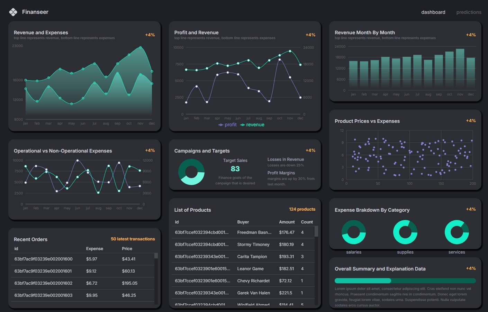

# 💰📊 Finance Dashboard App

A **full-stack MERN Finance Dashboard** featuring **machine learning predictions**. This project includes dynamic charts, interactive data tables, and real-time financial insights. It is built using modern tools such as Vite, Redux Toolkit, Material UI, and Recharts on the frontend, and Node.js, Express, and MongoDB on the backend.

## 🚀 Live Demo

👉 [https://finance-regression-dashboard-app.onrender.com](https://finance-regression-dashboard-app.onrender.com)

## 📸 Preview

---

## 🛠️ Tech Stack

### Frontend
- [Vite](https://vitejs.dev/guide/) – Fast frontend build tool
- [React Router v6](https://reactrouter.com/en/v6.3.0/getting-started/overview) – SPA routing
- [Redux Toolkit + RTK Query](https://redux-toolkit.js.org/rtk-query/overview) – State management and data fetching
- [Material UI (MUI)](https://mui.com/material-ui/getting-started/) – UI component library
- [Recharts](https://recharts.org/en-US/) – Data visualization library

### Backend
- [Node.js](https://nodejs.org/en/download/) – JavaScript runtime
- [Express.js](https://expressjs.com/) – Web framework for Node.js
- [MongoDB + Mongoose](https://mongoosejs.com/) – NoSQL database and object modeling

### Machine Learning
- [Regression-js](https://github.com/Tom-Alexander/regression-js) – JavaScript library for performing regression analysis

Hope you enjoy it!
